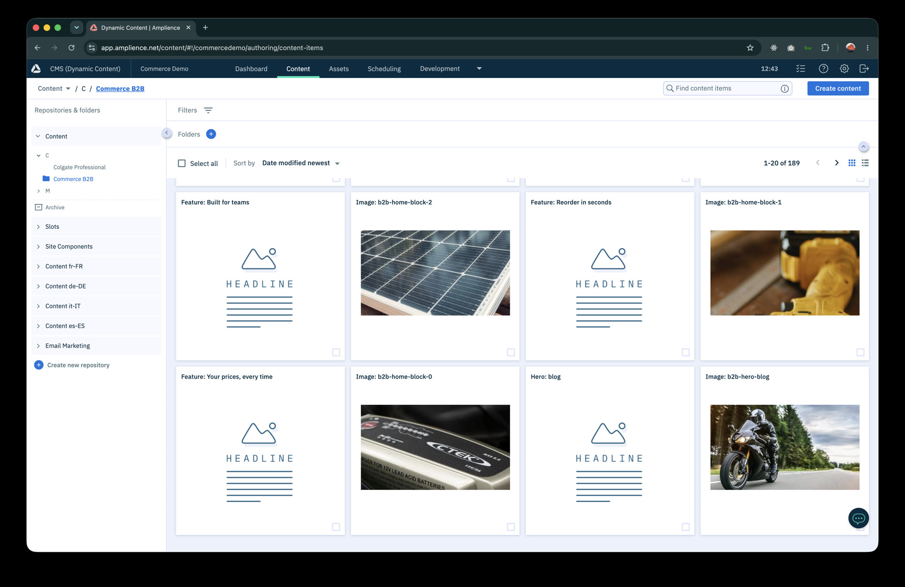
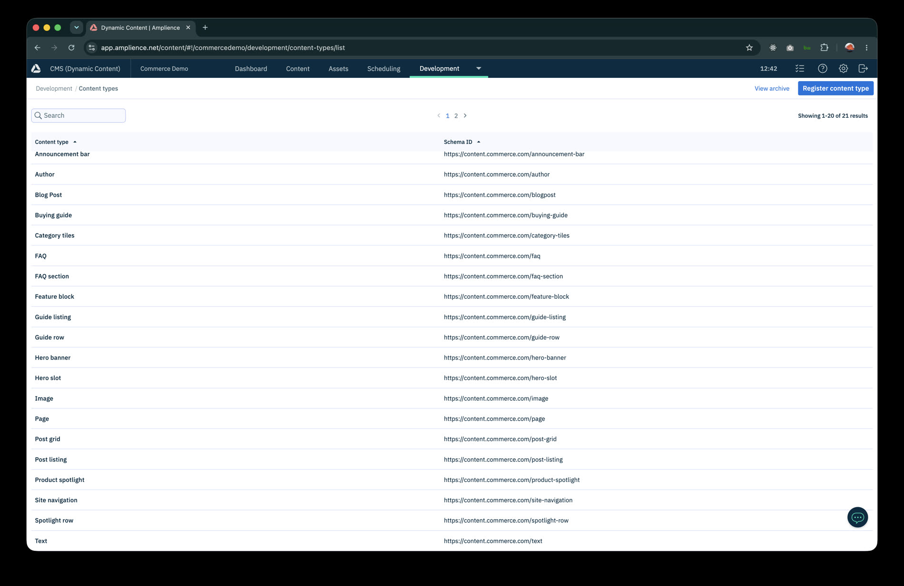
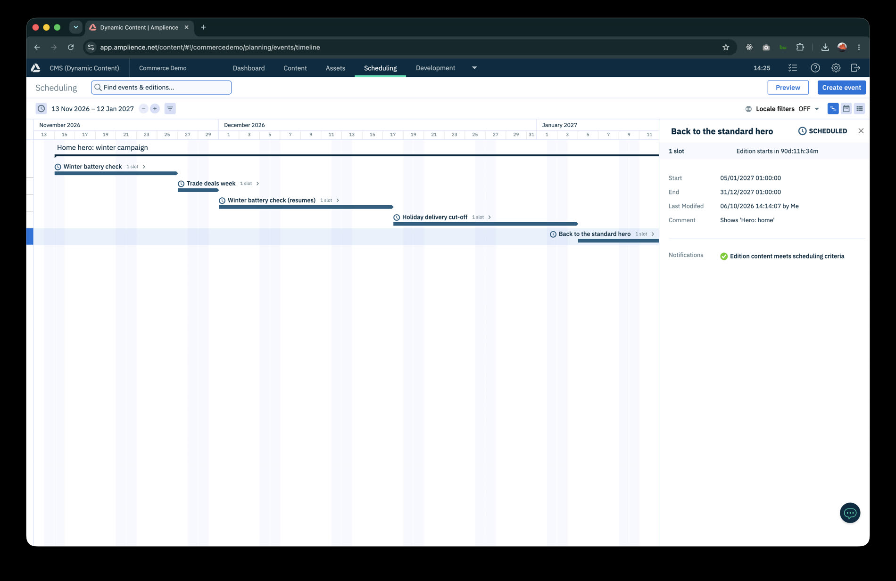
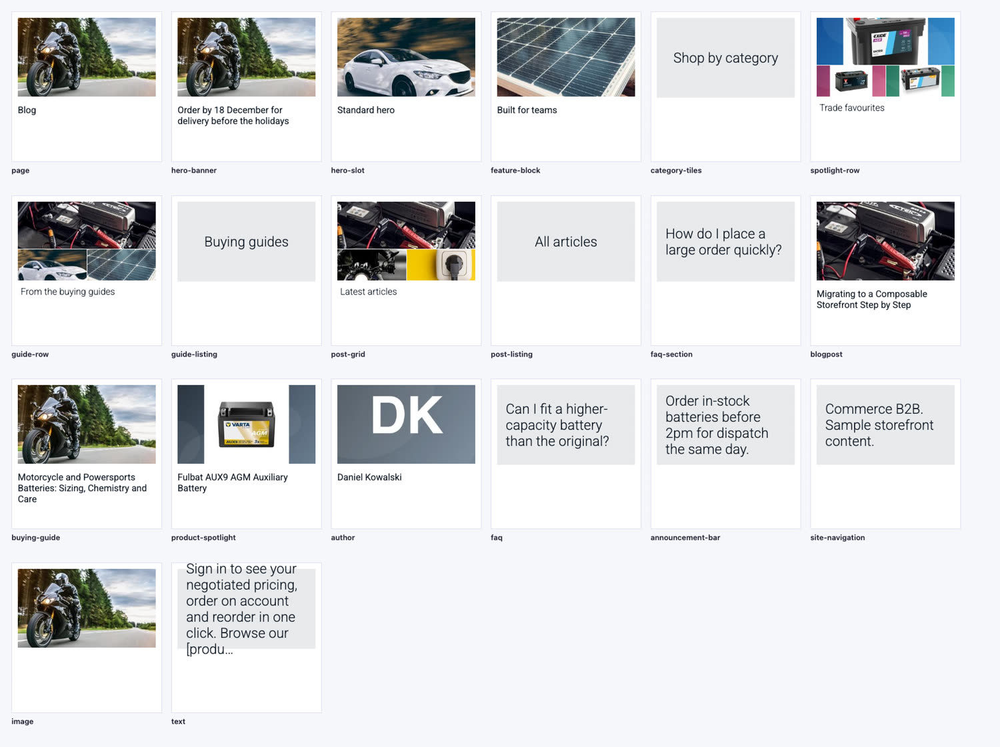

# Commerce B2B storefront (Amplience)

**Live:** https://amplience-commerce-b2b.vercel.app (English) and https://amplience-commerce-b2b.vercel.app/fr (French)

A headless B2B storefront for trade batteries. **Content** (pages built from stacked components, articles, guides, FAQs,
navigation, banners) lives in **Amplience Dynamic Content**; the **catalog, prices and cart** live in **BigCommerce**;
**Next.js 16** (App Router) composes them. The site is bilingual (English at `/`, French at `/fr`), editors get **Preview**
and **Real-time preview** next to the content form, and the home hero can be **scheduled** with slots and Editions.


```
  Amplience (hub: commercedemo)         BigCommerce (headless channel)
  content, EN + FR, CDN + staging        catalog, prices, cart, checkout
        │  Delivery API                        │  Storefront GraphQL
        └───────────────┐        ┌─────────────┘
                        ▼        ▼
                  Next.js 16 storefront  ──►  Visitors (EN / FR)
                        ▲
        Preview + Real-time preview (editors, in Dynamic Content)
```

## What is in it

| Area | What you get |
|---|---|
| **Pages** | A **Page** is a stack of components (hero, text, feature blocks, spotlights, guides, posts, FAQs, …) addressed by its **delivery key**: create one in Amplience and it is live at that URL, in both languages |
| **Home** | Scheduled hero slot, shop-by-category mosaic, value blocks, trade favourites, guides: all stacked in the `home` Page |
| **Catalog** | Mega menu from the live category tree; listing and category pages with search-as-you-type, sort and filters from BigCommerce |
| **Product page** | Gallery, price, stock, key specs, volume pricing, description, spec table, related guides, structured data |
| **Cart** | Add to cart, dynamic quantity stepper with instant totals, remove, hosted checkout hand-off |
| **Content** | Blog (36 articles, 6 authors), 6 buying guides, 15 FAQs, banners, announcement bar, navigation |
| **Languages** | English and French: routes, UI text, prices, dates and field-level localized Amplience content |
| **Editing** | Preview and Real-time preview visualizations; **time preview** (slider with preloaded states, edition bands, blink on change); Production and Preview deployments on Vercel |
| **Design** | "Workbench": light theme, 1100px pages, photography-led |

## Screenshots

<table>
<tr>
<td width="50%"><br><sub>Listing: search-as-you-type, removable filter chips, facets from BigCommerce</sub></td>
<td width="50%"><br><sub>Product page: gallery, price, stock, key specs, add to cart</sub></td>
</tr>
<tr>
<td><br><sub>Cart: instant quantity changes, saved to BigCommerce</sub></td>
<td><br><sub>The same page in English and French</sub></td>
</tr>
<tr>
<td><br><sub>Mega menu built from the live category tree</sub></td>
<td><br><sub>Buying guide with numbered steps and recommended products</sub></td>
</tr>
<tr>
<td><br><sub>The Commerce B2B folder in Dynamic Content</sub></td>
<td><br><sub>The 21 content types</sub></td>
</tr>
<tr>
<td><br><sub>Time preview: travel to any date; changed areas blink</sub></td>
<td><br><sub>The five scheduled editions on the Scheduling timeline</sub></td>
</tr>
<tr>
<td colspan="2"><br><sub>A card for every content type: images, titles and text in the content browser</sub></td>
</tr>
</table>

## Quick start

Requirements: Node 22+, Python 3.12+ (standard library only, for the scripts), an Amplience hub and a BigCommerce store
with a storefront channel.

```bash
npm install
cp .env.example .env.local      # then fill in the values (see docs/operations.md)
npm run dev                     # http://localhost:3000   (French: /fr)
```

Common commands:

```bash
npm run dev          # development server (Turbopack)
npm run lint         # ESLint
npx tsc --noEmit     # type-check
npm run build        # production build

# Set up the hub (idempotent; needs AMPLIENCE_PAT and AMPLIENCE_HUB_ID in .env.local)
python3 scripts/amplience/deploy_schemas.py     # content type schemas and content types
python3 scripts/amplience/seed.py               # images, EN + FR content, publish
python3 scripts/amplience/schedule.py           # scheduled hero example
python3 scripts/amplience/visualizations.py https://<staging-site> http://localhost:3000
python3 scripts/amplience/cards.py              # content type cards (thumbnails in Dynamic Content)
```

## Project layout

```
app/
  [locale]/                  every page lives under the locale segment
    layout.tsx               html lang, announcement bar, header (mega menu), footer
    page.tsx                 home = the Page with delivery key "home"
    [...slug]/page.tsx       any other Page (faq, guides, blog, …) by delivery key
    blog/[slug]  guides/[slug]   detail pages
    products/                listing, and [...slug] for categories and product pages
    cart/                    cart
  preview/                   Amplience visualizations: saved preview + real-time preview (non-production only)
  actions/cart.ts            server actions: add to cart, set quantity, remove
  globals.css                design tokens and base/component styles
proxy.ts                     locale routing (English rewritten to /en, French under /fr)
components/                  UI building blocks (page-blocks, hero, cards, mega menu, filters, cart…)
lib/
  amplience.ts               Delivery API client: by key, by schema, images, environments
  content.ts                 typed content mapping and fetchers
  markdown.ts  localized.ts  markdown rendering; form-model locale resolution
  image-loader.ts            global next/image loader (Dynamic Imaging)
  bigcommerce.ts             Storefront GraphQL: products, categories, search, cart
  i18n.ts                    locales, URL helpers, UI strings, label maps
scripts/amplience/           schemas, seeding, assets, scheduling, visualizations, sample content and images
docs/                        documentation (start at docs/README.md)
HISTORY.md                   every request and its result
```

## Documentation

Start with **[docs/README.md](docs/README.md)**. Highlights:

- [Architecture](docs/architecture.md): how the pieces fit, production vs preview, rendering and caching
- [Amplience](docs/amplience.md): the hub, the content model, slots and scheduling, assets
- [Preview and real-time preview](docs/visualizations.md): visualizations, the SDK, safeguards
- [Implementation details](docs/implementation.md): how each feature works
- [BigCommerce](docs/bigcommerce.md): channel, token, queries, listing, cart
- [Internationalization](docs/i18n.md): locales, URLs, translation workflow
- [Seeding](docs/seeding.md): the Management API scripts
- [Design system](docs/design-system.md): tokens, type, components
- [Operations](docs/operations.md): environment variables, deployment, troubleshooting
- [Decisions](docs/decisions.md): why things are the way they are

## Important notes

- **All sample content is fictional.** Author names, article text, FAQ policies, delivery claims and the
  `example.com` contact details are placeholders. Replace them before going public.
- **Product names and brands are not translated**: they come from BigCommerce, where the store has no French
  translations. Navigation, categories, specs and all UI text are translated.
- The storefront needs **no Amplience secret**: delivery is public for published content. The personal access token is
  used only by the scripts in `scripts/amplience/`.
- Secrets live only in `.env.local` (gitignored).
