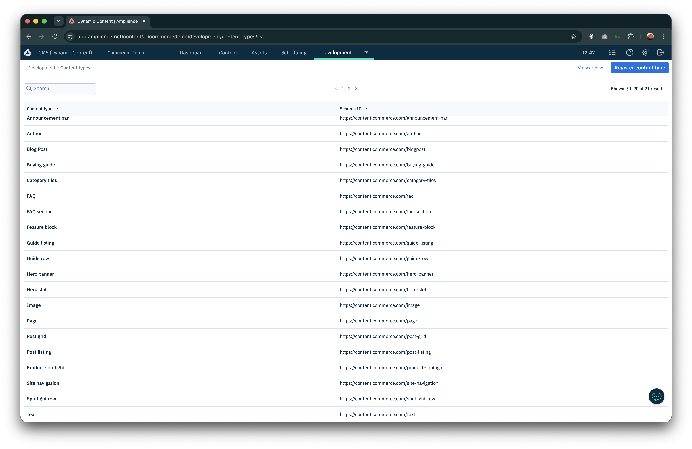
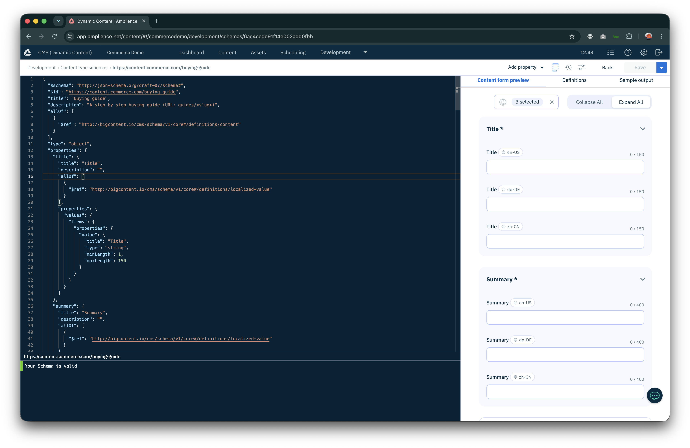
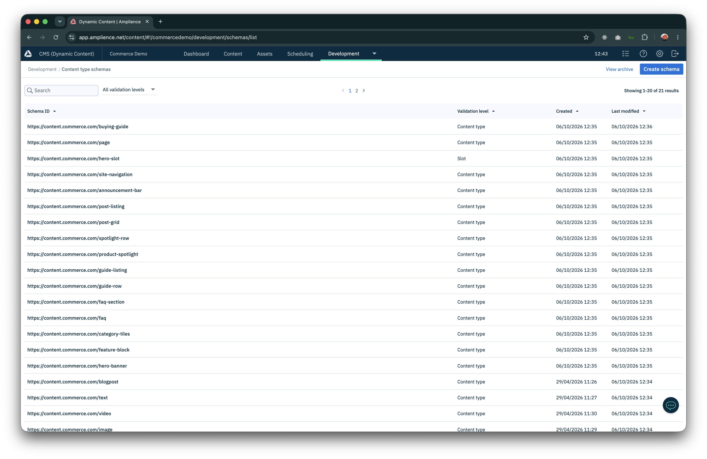
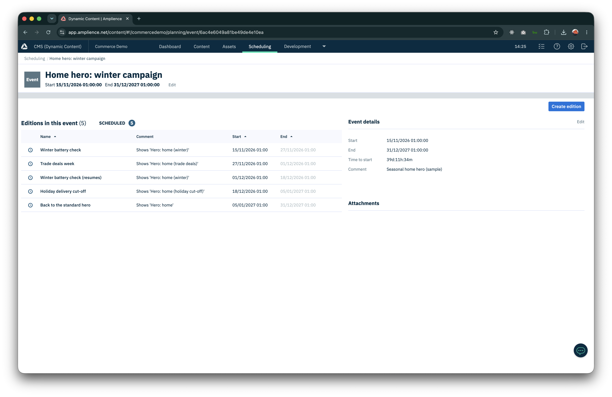
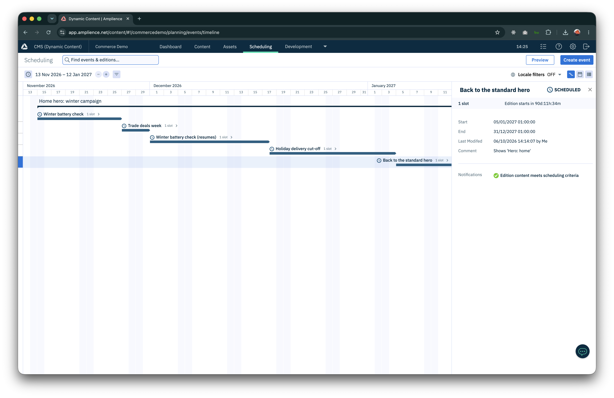
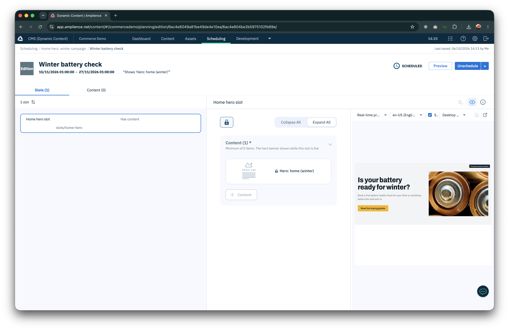
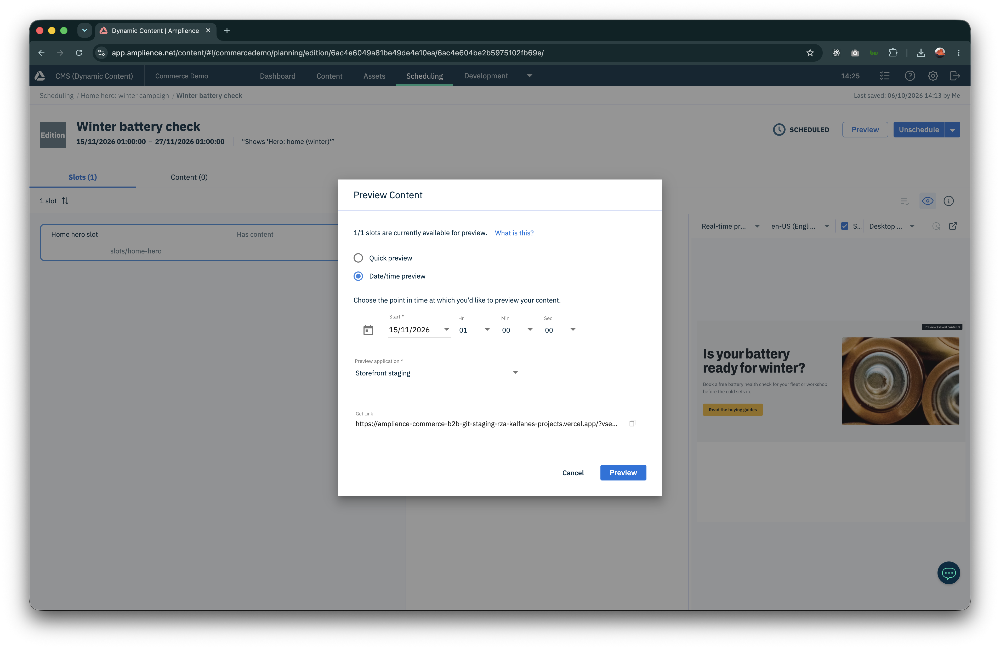

# Amplience

## The hub

| Setting | Value |
|---|---|
| Hub | `commercedemo` ("Commerce Demo"), Dynamic Content with Content Delivery v2 |
| Content repository | `content`, folder **C > Commerce B2B** (all items of this storefront) |
| Slots repository | `slots` (holds the schedulable hero slot) |
| Asset repository | `Assets`, folder **C > Commerce B2B** (images; served by Dynamic Imaging at `cdn.media.amplience.net/i/commercedemo/<name>`) |
| Locales | `en-US` (default) and `fr-FR` (others, such as `de-DE`, are enabled in the hub but unused) |
| Delivery (published) | `https://commercedemo.cdn.content.amplience.net` |
| Delivery (virtual staging, drafts) | `https://<id>.staging.bigcontent.io` (hub setting *Virtual staging environment*) |
| GraphQL | `https://commercedemo.cdn.content.amplience.net/graphql` (not used by the storefront, handy for exploring) |

*Development → Content types: the 21 types (the five blog schemas plus the Commerce B2B components and pages).*

## Content model

All schemas live under `https://content.commerce.com/` and are defined in `scripts/amplience/schemas.py` (JSON generated from
Python helpers; `deploy_schemas.py` pushes them). **Every text field is field-level localizable**: its value is
`{ "values": [{ "locale": "en-US", "value": "…" }, { "locale": "fr-FR", "value": "…" }] }`.

*Development → Schemas, with validation levels (Content type, Slot).*

| Schema | Purpose | Key fields |
|---|---|---|
| `page` | A URL-addressed page made of stacked components | `title`, `description`, `_meta.deliveryKey` (the path), `components[]` (links to any component below) |
| `hero-banner` | Page hero | `title`, `description`, `image`, `secondImage`, `cta {label, href}`, `variant` (`default` / `home`) |
| `hero-slot` | **Slot** holding one `hero-banner` | `slotContent[]` (max 1), `campaign` (name shown on the time preview timeline). Schedulable with Editions |
| `feature-block` | Image next to title and copy | `title`, `copy` (markdown), `image`, `layout` |
| `category-tiles` | BigCommerce category mosaic | `title` |
| `spotlight-row` / `product-spotlight` | Product cards with editorial copy | spotlight: `bcProductId` (required), `bcSku`, `tagline`, `summary`, `keyFeatures[]`, `useCases[]`, `badge`, `image`, `featured` |
| `guide-row` / `guide-listing` / `buying-guide` | Guides | guide: `_meta.deliveryKey` (`guides/<slug>`), `title`, `summary`, `image`, `audience`, `readMinutes`, `sortOrder`, `steps[]`, `checklist[]`, `recommendedProducts[]`, `relatedFaqs[]`, `author` |
| `post-grid` / `post-listing` | Chosen posts / all posts with search | grid: `posts[]`; listing: `searchPlaceholder`, `searchButtonLabel` |
| `faq-section` / `faq` | FAQs grouped by topic | faq: `question`, `answer` (markdown), `topic`, `sortOrder`, `featured` |
| `announcement-bar` | Banner above the header | `message`, `cta`, `style` (`info` / `promo` / `warning`), `audience` |
| `site-navigation` | Header, footer, contact (singleton, key `site/navigation`) | `headerLinks[]`, `footerColumns[]`, `contact`, `legalText`, `announcements[]` |
| `blogpost` | An article (`blog/<slug>`) | `account`, `title`, `authors[]`, `date`, `category`, `description`, `image`, `tags[]`, `readTime`, `content[]` (text / image / video) |
| `author`, `image`, `text`, `video` | Shared building blocks | image: DAM `image` + localizable `altText`; text: localizable markdown |

*The `buying-guide` schema in the schema editor, with the localized fields in the content form preview.*

The first five (`blogpost`, `text`, `image`, `video`, `author`) pre-existed in the hub; they were **re-versioned** to make
their text fields localizable (and `account` gained `Commerce B2B`). Older demo items of those types remain in the hub for
the admin UI but are not used and may no longer validate.

### Rules to remember

- A **delivery key** is the URL: pages `home`, `faq`, `guides`, `blog`; posts `blog/<slug>`; guides `guides/<slug>`.
  Keys are unique per hub and are the same in English and French (localization is inside the item).
- Enum values (`topic`, `audience`, `badge`, `style`) are stored in English; the UI maps them to French labels
  (`lib/i18n.ts`). Add a new choice in both the schema and `lib/i18n.ts`.
- Links in content are written without a language prefix (`/guides`); the app adds `/fr`.
- Linked items must be **published** for production to show them. Publishing a Page does not publish its components:
  use *Publish* on each item, or *Publish with dependencies* in the UI, or `scripts/amplience/seed.py`.
- The Filter API returns at most 12 items a page; `listBySchema` follows the cursor.

## Scheduling with slots

`hero-slot` is a **slot** schema (validation level *Slot*) stored in the `slots` repository. The home Page links to the
slot `slots/home-hero`, and the slot links to a `hero-banner`. In Dynamic Content, **Scheduling → Events → Editions**,
add the slot to an edition, put a hero banner in `slotContent` (a locked snapshot of it), set `campaign`, and choose the edition's
dates: at the start date the slot is published with that hero, and the home page changes without a deploy. An empty slot renders no hero.

`scripts/amplience/schedule.py` seeds a campaign calendar: the event **Home hero: winter campaign** with five consecutive,
scheduled editions that always leave exactly one hero in the slot.

| Edition | From | To | Hero shown |
|---|---|---|---|
| Winter battery check | 15 Nov 2026 | 27 Nov 2026 | "Is your battery ready for winter?" |
| Trade deals week | 27 Nov 2026 | 1 Dec 2026 | "Trade deals week" |
| Winter battery check (resumes) | 1 Dec 2026 | 18 Dec 2026 | "Is your battery ready for winter?" |
| Holiday delivery cut-off | 18 Dec 2026 | 5 Jan 2027 | "Order by 18 December for delivery before the holidays" |
| Back to the standard hero | 5 Jan 2027 | 31 Dec 2027 | the standard home hero |

*Scheduling → the event with its five scheduled editions.*

*The same editions on the scheduling timeline.*

*An edition: the home hero slot holds a locked snapshot of the hero for that period, previewed on the right.*

*Date/time preview with the "Storefront staging" preview application; the storefront opens with the time banner
([visualizations.md](visualizations.md#time-preview-banner)).*

Notes from building it:

- Edition slot content links to a **snapshot** of the hero (`POST /hubs/{id}/snapshots` with `contentRoot`), and the link needs
  `_meta.rootContentItemId` (plus `locked`); a plain content-item id is rejected.
- A scheduled event cannot be deleted: unschedule its editions first (`DELETE /editions/{id}/schedule`); `schedule.py` does this when re-run, which replaces the event.
- The `campaign` text travels with the slot content, which is how the storefront can name editions without reading the Management API.

## Assets

Images are uploaded to the DAM by `scripts/amplience/assets.py` (GraphQL Asset Management API: a temporary upload URL, then
`createOrUpdateAssetByName`, then `publishAsset`). Each is wrapped in an `image` content item that holds the DAM link and
localized alt text, so any component links to an `image` item rather than to the raw asset.

## Credentials

| Credential | Used by | Notes |
|---|---|---|
| Hub name | storefront, scripts | not secret |
| Virtual staging host | storefront (preview deployments only) | unguessable domain; the hub setting *Virtual staging environment* |
| Personal access token (PAT) | `scripts/amplience/` only | write access to the Management and GraphQL asset APIs; never in Vercel or the browser |
