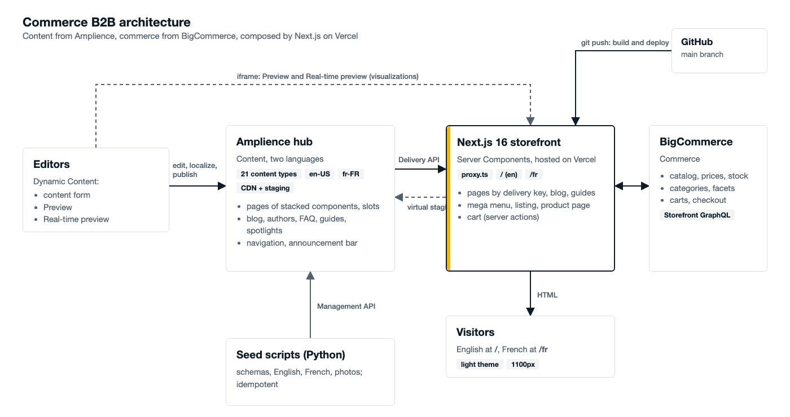

# Architecture

## Overview


*Editors work in Amplience Dynamic Content; the Next.js storefront on Vercel composes Amplience content with BigCommerce
commerce data. The editable source is `images/source/architecture.html`.*

<details>
<summary>Text version of the diagram</summary>

```
                    ┌──────────────────────────── Editors ─────────────────────────────┐
                    │ Amplience Dynamic Content: content form, Preview, Real-time      │
                    │ preview (visualizations), Editions + slots for scheduling        │
                    └───────────────┬───────────────────────────────▲──────────────────┘
                                    │ publish                       │ iframe: /preview?id=…
                                    ▼                               │
   ┌──────────────────────────┐   ┌────────────────────┐      ┌─────┴──────────────────┐
   │ Amplience hub            │   │ BigCommerce        │      │ Next.js 16 storefront  │
   │ "commercedemo"           │   │ "commerce b2b"     │      │ proxy.ts → [locale]    │
   │ • 21 content types       │◄──┤ headless channel   │◄─────┤ Server Components      │
   │ • locales en-US, fr-FR   │   │ catalog, prices,   │ GQL  │ Server Actions (cart,  │
   │ • CDN (published)        │   │ carts, checkout    │      │   live preview)        │
   │ • virtual staging (draft)│   └────────────────────┘      └─────┬──────────────────┘
   └──────────────▲───────────┘                                     │
                  └──────── Delivery API (key / filter) ────────────┘
                                                                    ▼
                                                           Visitors (EN at /, FR at /fr)
```

</details>

Two systems of record, one composition layer:

| Concern | Lives in | Why |
|---|---|---|
| Pages (stacked components), articles, guides, FAQs, banners, navigation, announcements, product *storytelling* | Amplience | Editors own wording, imagery, structure, translations and scheduling |
| Catalog, categories, brands, prices, stock, carts, checkout | BigCommerce | Commerce data must stay authoritative and live |
| Product spotlight ↔ product link | `product-spotlight.bcProductId` | Editorial content is *keyed* to a product ID; price and stock are never copied into the CMS |

## Technology

| Layer | Choice |
|---|---|
| Framework | Next.js 16.3 (App Router, Turbopack), React 19.2, TypeScript |
| Styling | Tailwind CSS v4 + CSS custom properties (see [design-system.md](design-system.md)) |
| Content | Amplience Delivery API (plain `fetch`), `marked` for markdown |
| Images | Amplience Dynamic Imaging through a global `next/image` loader |
| Editing | Amplience visualizations: `dc-visualization-sdk` for real-time preview |
| Commerce | BigCommerce Storefront GraphQL API (plain `fetch`) |
| Fonts | Archivo (display, variable width) and IBM Plex Sans via `next/font/google` |
| Tooling | Python 3 (stdlib only) for the Management API scripts |

> The project's `AGENTS.md` warns that this Next.js version has breaking changes. The docs in
> `node_modules/next/dist/docs/` are the reference (e.g. `params` and `searchParams` are Promises, the middleware file is
> now `proxy.ts`).

## Request lifecycle

1. **`proxy.ts`** runs first. `/fr/...` passes through. `/en/...` redirects (308) to the clean URL. Every other path is
   *rewritten* internally to `/en/...`, so English keeps clean URLs while still matching `app/[locale]`. `/preview` is skipped.
2. **`app/[locale]/layout.tsx`** validates the locale, sets `<html lang>`, and renders the announcement bar, header
   (with the mega menu) and footer. These fetch their own data in parallel with the page.
3. **The page** (a Server Component) fetches the Page by delivery key from Amplience (`depth=all`, so linked components come
   inlined) and commerce data from BigCommerce, and renders HTML.
4. **Client Components** hydrate only where interaction is needed (listed below).
5. **Server Actions** handle cart mutations (they set the cart cookie and revalidate the layout) and, in preview
   deployments only, real-time preview rendering.

```
Browser ──► proxy.ts ──► app/[locale]/…page.tsx ──┬─► lib/content.ts ──► lib/amplience.ts ──► Amplience Delivery API
                                                  └─► lib/bigcommerce.ts                 ──► BigCommerce GraphQL
```

## Production and Preview

The same code runs in two content modes, chosen by one environment variable, `AMPLIENCE_DELIVERY_HOST`:

| | Production | Preview |
|---|---|---|
| Vercel scope | Production (branch `main`) | Preview (branch `staging` and every other branch) |
| Content read from | CDN `commercedemo.cdn.content.amplience.net` | virtual staging `<id>.staging.bigcontent.io` |
| Sees | **published** content only | the latest **saved** content, published or not |
| `/preview` route | disabled (404) | enabled, used by Amplience visualizations |
| `X-Content-Environment` header | `production` | `preview` |

## Rendering and caching

- Every page is **dynamically rendered** (it reads `searchParams` and/or cookies).
- **Amplience** reads use `fetch` with `next: { revalidate: 60 }` in production and `no-store` in preview, so editors see
  saves immediately on the preview site and a publish reaches production within a minute. Production could use publish
  webhooks plus tag-based revalidation for instant updates (see [decisions.md](decisions.md)).
- **BigCommerce** reads use `fetch` with `next: { revalidate: 300 }`, except carts (`no-store`).
- The **time preview** (preview deployments only) keeps a preloaded timeline of content changes in Vercel's **Runtime Cache**, shared by all function
  instances, so scrubbing through time needs no Amplience requests ([visualizations.md](visualizations.md#how-time-travel-stays-fast)).

## Client Components (the only JavaScript that ships for interaction)

| Component | Purpose |
|---|---|
| `RealtimePreview` | preview deployments only: follows the Amplience content form |
| `TimePreviewBar`, `TimeSwitch`, `ChangeFlash` | preview deployments only: time preview banner, instant switching between preloaded time states, blink on change ([visualizations.md](visualizations.md#how-time-travel-stays-fast)) |
| `LocaleSwitcher` | links to the same page in the other language |
| `MegaMenu` | hover/click product menu |
| `PlpForm`, `SearchBox`, `PriceRange`, `SortSelect` | auto-applying filters and search-as-you-type |
| `ProductGallery`, `AddToCart` | product page interaction |
| `CartView`, `QtyStepper` | optimistic cart editing |

Everything else is server-rendered HTML.

## Data model at a glance

```
page ──components──► hero-banner | hero-slot ──slotContent──► hero-banner
                     feature-block | text | image | video | category-tiles
                     spotlight-row ──► product-spotlight      guide-row ──► buying-guide
                     post-grid ──► blogpost                   post-listing | guide-listing
                     faq-section ──► faq
blogpost ──authors──► author ──avatar──► image        blogpost ──content──► text | image | video
buying-guide ──author──► author, ──relatedFaqs──► faq
site-navigation ──announcements──► announcement-bar
product-spotlight ··bcProductId·· BigCommerce product      buying-guide ··recommendedProducts·· BigCommerce products
```

Links (`──►`) are Amplience content links; dotted links (`··`) are plain IDs resolved at request time against BigCommerce,
so a deleted or renamed product never breaks a content item.

## Security model

- The storefront needs **no secret for Amplience**: the Delivery API is public for published content, and the virtual
  staging host is an unguessable domain used only by preview deployments. There are no `NEXT_PUBLIC_` variables.
- The BigCommerce Storefront token is scoped per **channel** and origin, and expires (90 days by default).
- The **personal access token (PAT)** exists only for the scripts in `scripts/amplience/`; never set it in Vercel.
- `Content-Security-Policy: frame-ancestors` allows only `*.amplience.net` to embed the site (visualizations).
- `/preview` is a 404 in production, only accepts a content id plus the hub's staging host, and its server action refuses to
  run in production.
- Markdown from Amplience and rich text from BigCommerce are rendered with `dangerouslySetInnerHTML`. Both are trusted,
  editor-controlled sources; do not render visitor-supplied HTML this way.
