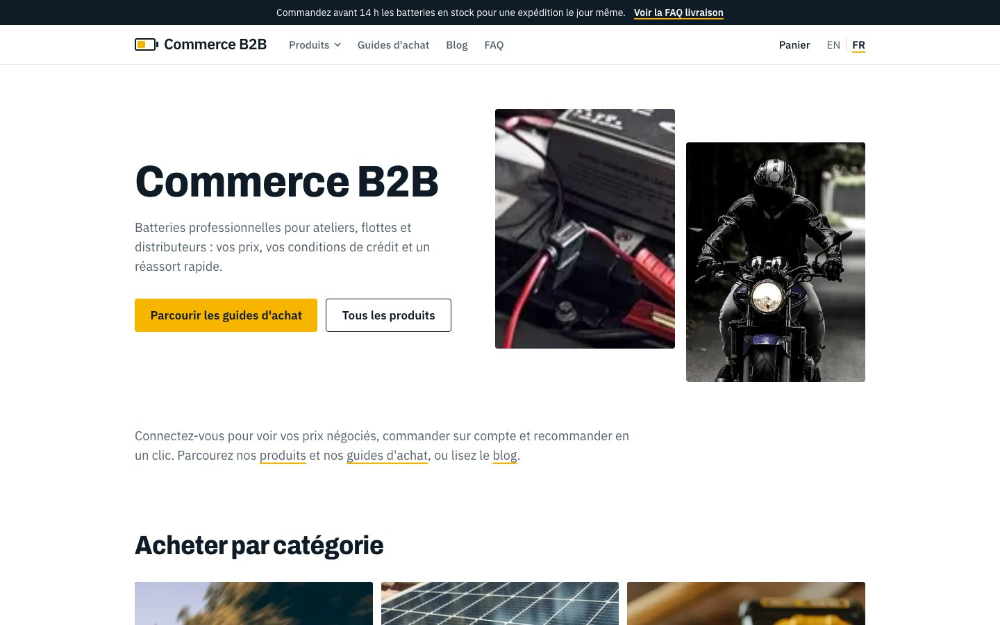

# Internationalization

Languages: **English** (default) and **French**. The architecture supports more.

*The same product page in English (`/products/…`) and French (`/fr/products/…`): UI text, prices (`165,60 £GB`) and spec labels follow the language.*

## URL strategy

| URL | Locale | Notes |
|---|---|---|
| `/blog`, `/products/…` | English | clean URLs, no prefix |
| `/fr/blog`, `/fr/products/…` | French | prefix `/fr` |
| `/en/blog` | → 308 redirect to `/blog` | each page has one canonical address |

`proxy.ts` implements this: `/fr/…` passes through; `/en/…` redirects; everything else is **rewritten** to `/en/…`
internally. All routes live under `app/[locale]/`.

Locale codes:

| URL segment | Amplience locale (delivery `locale=`) | Formatting (Intl) | `lang` |
|---|---|---|---|
| `en` | `en-US` | `en-GB` | `en` |
| `fr` | `fr-FR,en-US` (falls back to English per field) | `fr-FR` | `fr` |

Defined in `lib/i18n.ts` (`LOCALES`, `INTL_LOCALE`) and `lib/amplience.ts` (`AMP_LOCALES`). Helpers: `localePath(locale, "/blog")`,
`stripLocale(pathname)`, `isLocale(value)`. **Always build links with `localePath`**, including links stored in
Amplience (`/faq`, `/blog`), which are stored *without* a prefix.

## What is translated and where

| Content | Where | Mechanism |
|---|---|---|
| Articles, guides, FAQs, banners, pages, navigation, announcements, spotlights, authors | Amplience | field-level localization: each text field holds an `en-US` and a `fr-FR` value in the same content item |
| Buttons, labels, messages, filter and cart text | `lib/i18n.ts` (`en` / `fr` dictionaries) | `getMessages(locale)`; the `Messages` type forces both languages to define every key |
| Select-field values (FAQ topic, guide audience, spotlight badge) | `TOPIC_FR`, `AUDIENCE_FR`, `BADGE_FR` | `topicLabel` / `audienceLabel` / `badgeLabel` |
| Category labels | `CATEGORY_FR` | `categoryLabel` |
| Product specs (names, common values) | `SPEC_NAMES_FR` + rules | `translateSpec` |
| Dates and prices | `Intl` | `formatDate`, `formatMoney` |
| Product names, descriptions, categories, custom fields | BigCommerce | Store Translations, read with the locale directive; URLs keep the English slugs (see [bigcommerce.md](bigcommerce.md)) |

## Content fallback

Every read asks for the locale **and** `includeFallback()`. A French request for an entry that has no French version
returns the English one, so the site never shows a hole. The reverse is not true: English never falls back to French.

## Slugs: shared for content, translated for the catalog

Content pages (blog, guides, FAQ) use the same slug in both languages (`/fr/blog/contract-pricing-101-giving-every-buyer-their-own-price`),
which keeps the language switcher exact (swap the prefix). The **catalog** uses BigCommerce's translated URLs
(`/products/automotive-batteries/...` and `/fr/produits/batteries-automobiles/...`), so its language switcher looks the page up
([implementation.md](implementation.md#the-catalog-routes)). See [decisions.md](decisions.md), D9 and D11.

## SEO

Pages that matter export `generateMetadata` with `alternates: alternatesFor(locale, path)`, which emits `canonical` and
`hreflang` links (`en`, `fr`, `x-default`). `<html lang>` follows the locale.

## Language switcher

*The French home page: header with the language switcher (EN / FR), translated hero, navigation and announcement bar.*

`components/locale-switcher.tsx` (client) reads the current path, strips any prefix and links to the same path in every
locale, preserving the query string (filters survive a language change).

## Translating content in Amplience

Every text field of the content types is **localizable** (`values: [{ locale, value }]`). In the content form, pick the
locales to show in the locale selector and fill the `fr-FR` input next to `en-US`. The Delivery API is asked for
`locale=fr-FR,en-US`, so a field that has no French value falls back to English instead of rendering empty.

**Via the scripts** ([seeding.md](seeding.md)): translations live in Python files (`scripts/amplience/data/content_fr*.py`);
`seed.py` writes both languages into each item.

Checklist for a fully translated page:

1. The Page, its components and the items they link to have an `fr-FR` value for each text field.
2. The Page and everything it links to is published (a draft is only visible in preview).
3. Select (enum) values still match the allowed English values; the UI maps them to French labels.
4. Links stored in content are **unprefixed** (`/guides`): the app adds `/fr`, including inside markdown.

## Adding another language (for example German)

1. **Amplience**: the hub already has `de-DE`, `es-ES`, `it-IT` enabled; add values for the new locale in the content.
2. **`lib/i18n.ts`**: add `"de"` to `LOCALES`; add entries to `AMP_LOCALES` (`de-DE,en-US`, in `lib/amplience.ts`), `INTL_LOCALE` (`de-DE`),
   `LANGUAGE_NAME`; add a `de` messages object (the type checker lists every missing key); extend the label maps
   (`TOPIC_`, `AUDIENCE_`, `BADGE_`, `CATEGORY_`, `SPEC_NAMES_`).
3. **`proxy.ts`**: allow the new prefix (`first === "fr"` → a list of non-default locales); update the `stripLocale` regex in `lib/i18n.ts`.
4. **Content**: translate the text fields (in Dynamic Content, or extend `seed.py` with a German data module).
5. **`alternatesFor`**: add the language to `languages`.
6. Verify: `/de`, the switcher, a product page, the cart, a blog post.

## Known gaps

- Brand names come from BigCommerce as stored (not translated).
- The French announcement/promo claims are as fictional as the English ones.
- There is no automatic locale detection from `Accept-Language` (visitors choose with the switcher); add it in `proxy.ts` if wanted.
