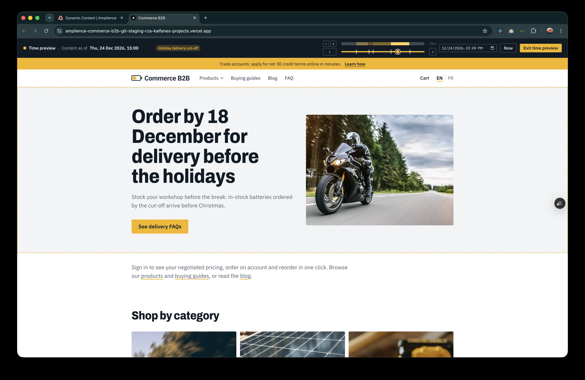

# Preview and real-time preview (visualizations)

Amplience embeds the storefront in an iframe next to the content form. Two visualizations are registered on the content types:

| Visualization | URL template | Shows |
|---|---|---|
| **Preview** | `<site>/preview?id={{content.sys.id}}&vse={{vse.domain}}&locales={{locales}}` | the latest **saved** version, from virtual staging |
| **Real-time preview** | same, plus `&realtime=true` | the form as you type, **without saving** |

`<site>` is the staging site (`https://amplience-commerce-b2b-git-staging-rza-kalfanes-projects.vercel.app`) or
`http://localhost:3000` for local development. `scripts/amplience/visualizations.py <site>…` registers them.

## How it works

1. **`app/preview/page.tsx`** receives the content id and the virtual staging domain. It only accepts a UUID and a host that
   ends in `.staging.bigcontent.io` (or the configured host), fetches `/content/id/<id>?depth=all&format=inlined&locale=…`
   and renders the item with `renderPreview()` (`app/preview/render.tsx`).
2. **`previewable()`** (`lib/content.ts`) maps any item the same way the live site does: a Page, a blog post, a buying guide,
   or a single component (hero, feature block, spotlight row…) rendered on its own. Components are the same React components
   as the live site, so the preview is pixel-identical.
3. With **`realtime=true`**, `RealtimePreview` (client) starts `dc-visualization-sdk`: `sdk.form.get({ allowInvalid: true })`
   for the first model, `sdk.form.changed(…)` for every edit and `sdk.locale.changed(…)` when the editor switches locale.
   Each model (debounced 150 ms) goes to the **`renderModel` server action**, which returns the rendered React tree; only the
   latest response is shown. `lib/localized.ts` resolves any `{ values: [{ locale, value }] }` wrappers the form model may still
   carry, with the same English fallback as the Delivery API.
4. Opened outside Dynamic Content (no iframe host), the SDK handshake times out after 4 seconds and the page stays on the
   server-rendered saved version; the badge in the corner says so.

```
Dynamic Content form ──postMessage──► RealtimePreview ──server action──► renderPreview() ──► React tree ──► iframe
                  saved item ──► /preview?id=… ──► virtual staging ──► renderPreview() ──► HTML
```

## Previewing the whole site from Scheduling (preview applications)

Visualizations preview one item next to its form. To preview the **site** at a date or in an edition (for example to see the
scheduled home hero), Dynamic Content uses **Settings → Preview** applications. They are a hub setting that the Management
API cannot update without the hub's DAM publishing secret, so add them in the UI:

| Preview application name | Preview application URL |
|---|---|
| `Storefront staging` | `https://amplience-commerce-b2b-git-staging-rza-kalfanes-projects.vercel.app/?vse={{vse.domain}}` |
| `Storefront local` | `http://localhost:3000/?vse={{vse.domain}}` |

`vse.domain` is a virtual staging domain **frozen at the date and time (or edition) being previewed**, shaped
`<vse id>-<token>-<unix ms>.staging.bigcontent.io`. `proxy.ts` stores it in the `amp_vse` cookie (preview deployments only, valid
`*.staging.bigcontent.io` hosts only) and redirects to the clean URL; `lib/amplience.ts` then reads every item from that host,
so the whole site, including the slot's hero, shows what will be live then. In production the parameter is ignored.

### Time preview banner


*Previewing 24 Dec 2026: the "Holiday delivery cut-off" edition is live, its hero blinks with a dotted outline because it just changed, and the
slider shows the zoomed timeline with edition bands, change markers, zoom −/+ and previous/next change.*


While a session is pinned to a moment, every page shows a sticky **Time preview** banner (`components/time-preview-bar.tsx`):

- the date and time being previewed (fixed width, so the edition tag never moves), the **name of the edition / campaign** that is live then, and a reminder that the catalog
  and prices are live (only the content is time-pinned);
- a **slider** (30 days back to a year ahead, hourly steps) and a **date/time field**;
- **‹ ›** to jump to the previous / next change, **− +** to zoom the timeline (the view starts fitted on the editions, 79 days here; steps
  of 395 / 180 / 90 / 45 / 21 days around the current time; the visible span is shown above ›), **Now**, and **Exit time preview**
  (clears the pin, back to the latest saved content);
- on the slider, a **progress fill** while the time states are preloaded, then **change markers** and one **named band per
  edition** (hover for its name and dates);
- areas whose content changes **blink with a dotted amber outline** for about two seconds (`components/change-flash.tsx`).

You can also enter it without Dynamic Content: `…/?time=2026-12-01T10:00` (any date `Date.parse` understands). That needs
`AMPLIENCE_TIME_TOKEN`: the `<token>` part of a time-pinned domain, which Amplience does not expose through an API. Open
any preview application once from Scheduling and copy the middle part of the domain in the address bar (it does not depend on
the date). Sessions that start from Amplience reuse the token of the domain they were given. `?vse=reset` or `?time=now` clears the pin.

### How time travel stays fast

Content pinned to a moment only changes at a few instants (an Edition starting, a slot being published), so the storefront
**preloads the timeline** instead of asking Amplience for every slider step.

1. **Timeline** (`lib/timeline.ts`). The first pinned render registers the requests it makes (navigation, the page, lists).
   In the background (inside `after()`, so the function stays alive) the server probes the slider's range at 15 instants and, wherever two neighbouring probes differ,
   bisects down to the hour to find the exact change point. One probe loads *all* registered requests from one time-pinned
   host. The staging host rewrites some links to its own domain (which contains the timestamp), so that text is blanked
   before comparing. A gap between two probes becomes **resolved** as soon as it is known and is answered from memory at once,
   even while the rest is still loading; that is the progress fill. Stretches known to contain a change whose exact point is still being
   searched pulse; the change points are then found left to right, two at a time, so markers and edition bands appear one after the other
   (the view refits onto the editions as they are found, until you zoom yourself). The change points are the slider markers and the
   previous / next buttons.
2. **Rate limits.** Virtual staging allows **7 requests per second (350 per minute)**, shared by every staging read, and answers
   `429` beyond that ([limits](https://amplience.com/developers/docs/apis/limits/)). Background probes are paced to about 6 per second, run four at a
   time, back off exponentially on `429` (`amp()` in `lib/amplience.ts`) and a build interrupted by a limit **resumes** where it
   stopped. Pages themselves are never delayed. A typical build (5 changes, 2 requests per probe) takes about 25 seconds.
3. **Instant mode** (`components/time-variants.tsx`, `time-switch.tsx`). Once the timeline is complete, the server renders the
   page **once per stretch of time between two changes** (every data getter takes an optional `at`) and sends them together. The
   browser shows the variant that matches the slider, so moving the slider needs **no request**: a swap takes 10–20 ms. The other
   variants wait in a hidden container so their images are already loaded. The banner only syncs the server (cookie, header,
   announcement) 700 ms after you stop moving. Until the timeline is complete the slider falls back to one server round trip per
   step (about 400 ms once warm).
4. **Edition names.** The storefront cannot read edition names (they live in the Management API), so the scheduler stores the
   name in the slot content: `hero-slot.campaign`. `pageLabel()` reads it, and `TimeVariants` hands one label per stretch to the banner.
5. **Blinking.** Each page component is wrapped in `<Flash id value>`; a hash of its content is compared with the last one seen for
   the same area, even across variants, so only areas that really changed blink. An area that appears right after you moved the
   time (a hero whose slot just got content) blinks too; first paint never does.

6. **Shared across instances.** On Vercel each request can reach a different function instance, so the timeline is stored in the
   **Runtime Cache** (per-region, shared by all instances, separate for Production and Preview; an in-process map stands in
   locally): a small *plan* (probed instants and the state hash each shows) plus one gzipped blob per distinct content *state*.
   One instance builds at a time (a soft lock). A stale plan (older than 8 minutes) keeps serving while its replacement is built
   under a separate key and swapped in only when complete, so the slider never "unloads". A build interrupted by the function's
   time limit **resumes** from its stored progress, and the status polling restarts one that died. Any instance can load the
   requests another registered, because the request key says what to fetch (`setResolver`).
7. **Time to ready, and warming.** A cold build takes 20-45 s for light pages (home, FAQ) and 1-2 minutes with the blog lists included (36 posts over three pages per
   probe). Nobody should wait for that, so a GitHub Action warms the timeline after each Preview deploy (`/api/warm`, see [operations.md](operations.md#time-preview-operations)),
   the cache entry lives 4 hours, and a stale one is rebuilt in the background while it keeps serving; the page re-renders itself when the fresh one lands. Until a
   timeline is ready the page still works, one server round trip per step; once ready, nothing is requested.

Changes shorter than the probe gap (about four weeks) can be missed. Everything here lives on preview deployments only; none of it exists in production.

## Safeguards

- `/preview` returns **404 in production** (`CONTENT_ENV === "production"`) and the server action throws there.
- The staging host and content id are validated, so the route cannot be used to fetch arbitrary URLs.
- `Content-Security-Policy: frame-ancestors` allows only `https://*.amplience.net`.
- Preview deployments are read-only: they never write to Amplience.
- The time preview (cookie, server action, timeline) is inert in production: `?time=` / `?vse=` are ignored and the action throws.

## Using it

1. Open an item (a Page, post, guide or component) in Dynamic Content → the visualization selector → **Real-time preview**.
2. Switch the locale in the visualization toolbar to see the French values; the device selector resizes the frame.
3. For scheduled slots, open the edition's snapshot preview: slot content is resolved by Amplience before the page is rendered.

## Troubleshooting

| Symptom | Check |
|---|---|
| Blank frame / refused to connect | the site's CSP; the visualization URL must be `https` (or `http://localhost`) |
| 404 in the frame | `AMPLIENCE_DELIVERY_HOST` is unset on that deployment (production mode), or the id is not a content item id |
| Preview works, real-time does not | the URL lacks `realtime=true`; or the page is opened outside Dynamic Content |
| Linked items missing in the frame | the linked item is archived or deleted; drafts do show in virtual staging |
